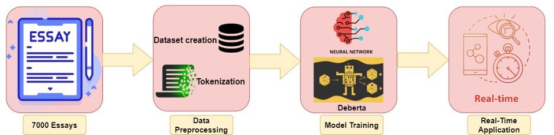
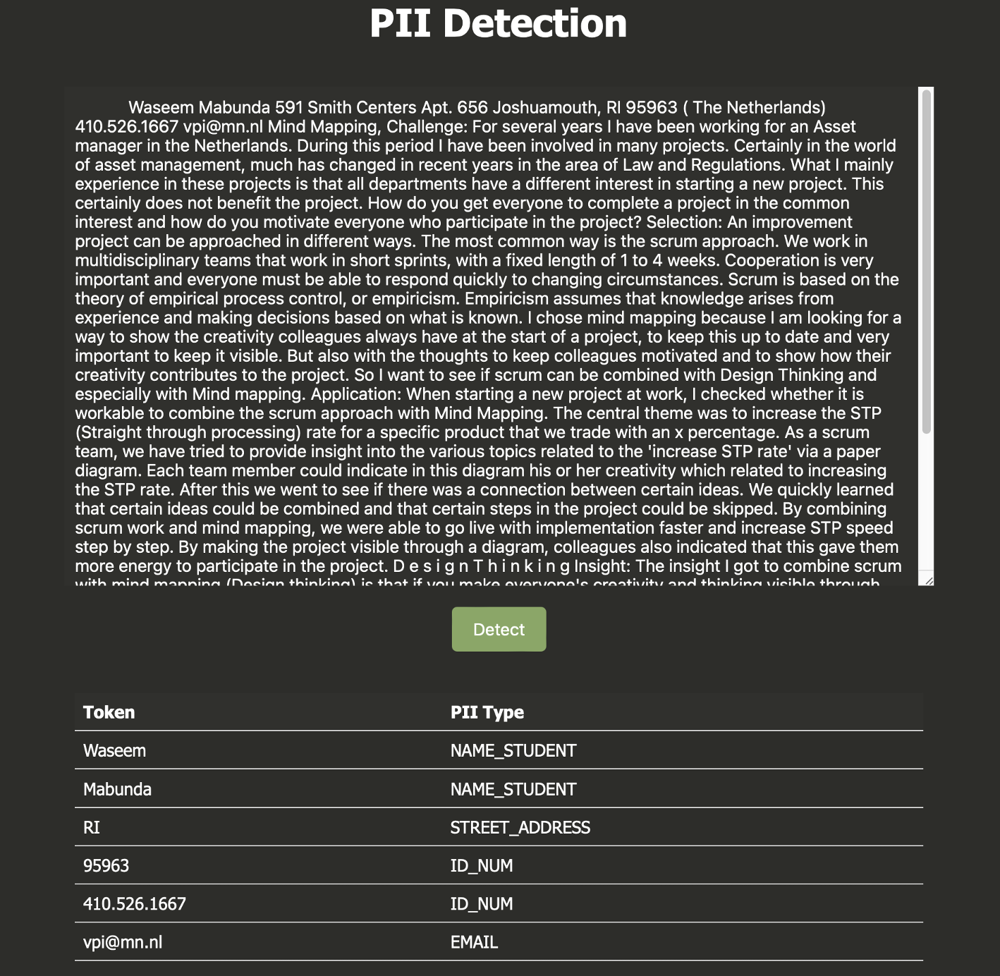

# PII Data Detection Framework

## Overview
The PII Data Detection project addresses the increasing concern of privacy risks posed by the leakage of Personally Identifiable Information (PII) in textual data. By leveraging state-of-the-art deep learning techniques, this framework detects and classifies PII with high accuracy, ensuring compliance with data protection regulations such as GDPR, CCPA, and HIPAA.

## Key Features
- **Multi-class Classification**: Detects and classifies seven types of PII (e.g., names, emails, phone numbers).
- **High Accuracy**: Achieves an impressive F5 score of 94% prioritizing recall to minimize false negatives.
- **Real-time Application**: Provides a Flask-based interface for real-time detection and classification of PII in text inputs.
- **Scalability**: Utilizes a robust pipeline to handle large datasets and diverse data formats.

## Dataset
The dataset consists of 10,000 essays collected from an open online course, where original PII has been replaced with surrogate identifiers. Labels are provided in the BIO format (Beginning, Inner, Outside). The types of PII detected are:

| Label            | Description                                 |
|------------------|---------------------------------------------|
| NAME_STUDENT     | Full or partial name of a student          |
| EMAIL            | Email address                              |
| USERNAME         | Username on any platform                   |
| ID_NUM           | Identification numbers (e.g., student ID)  |
| PHONE_NUM        | Phone numbers                              |
| URL_PERSONAL     | Personal URLs                              |
| STREET_ADDRESS   | Full or partial street addresses           |

## Methodology

### Data Preprocessing
1. **Dataset Pipeline**: The pipeline prepares data by tokenizing, shuffling, batching, and prefetching.
2. **Tokenization**: Text is tokenized using `DeBERTaV3Tokenizer`, which employs subword tokenization based on SentencePiece.
3. **Special Tokens**: Adds special tokens such as `[CLS]`, `[SEP]`, and `[PAD]` using `MultiSegmentPacker`.

### Model Architecture
The framework employs the `DeBERTaV3` transformer model with the following components:
- **Backbone**: `DeBERTaV3_base_en`, providing contextual embeddings for input tokens.
- **Dense Layers**: Three fully connected layers with ReLU activations and dropout for regularization.
- **Output Layer**: A dense layer outputs logits for token classification.

The model is compiled with the following configurations:
- **Loss Function**: CrossEntropy Loss
- **Evaluation Metric**: F5 score (weighted to prioritize recall)
- **Optimizer**: Adam optimizer
- **Learning Rate Scheduler**: Adapts the learning rate dynamically, starting at 6e-6 and peaking at 2.5e-5.

### Training and Evaluation
- **Hardware**: Trained on an NVIDIA A100 GPU with 40 GB RAM.
- **Epochs**: 10 epochs with dynamic learning rates.
- **Performance**: The model achieves an F5 score of 94%, ensuring robust identification of PII.

### Framework Architecture
Below is the framework architecture of the proposed system:

## Real-Time Application
The model is deployed as a Flask application with a user-friendly interface:
- **Input**: A text box to enter textual data.
- **Output**: Highlights detected PII and categorizes them.
- **Backend**: The trained model processes inputs in real time to ensure efficient PII detection.

### Flask Application Screenshot
Below is a screenshot of the Flask application:

## Results
The framework demonstrates:
- **High Recall**: Minimizes the risk of undetected PII.
- **Contextual Understanding**: Accurately identifies quasi-identifiers alongside direct identifiers.
- **Scalability**: Handles diverse datasets and textual formats effectively.

## Future Work
- Expand PII categories to include additional identifiers.
- Optimize the model for mobile and edge devices.
- Integrate with data masking tools for automatic redaction of PII.

## Contributors
- [Alan Mohan](https://github.com/alanmohan)
- [Ameya Navare](https://github.com/ameya-nav)

## License
This project is licensed under the MIT License. See the LICENSE file for details.

